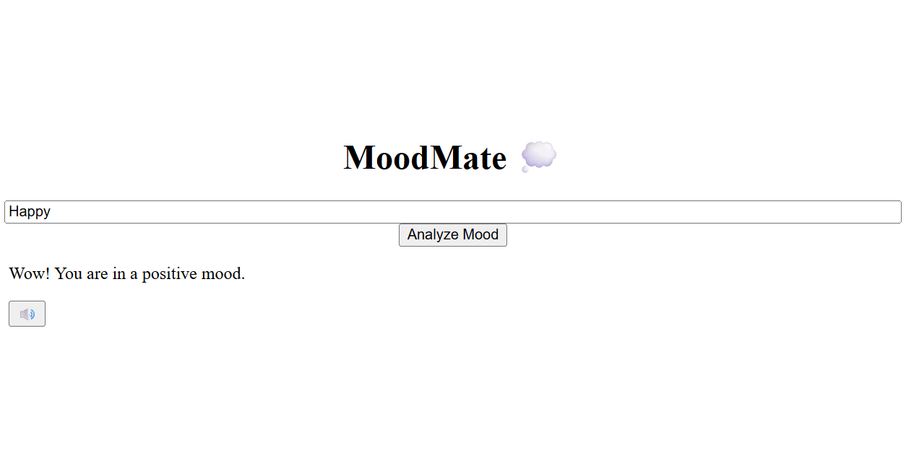

# MoodMate (React + Vite Project) 

**MoodMate** is a lightweight, client-side mood detection project that analyzes user input and responds with a mood classification — Positive, Negative. It also features voice feedback to read out the detected mood using the browser's built-in speech synthesis.

## Live Demo
Check out the live site: [https://moodmate-five.vercel.app/](https://moodmate-five.vercel.app/)
---

## Features

- Detects mood from user input (positive, negative, or neutral)
- Voice feedback using Web Speech API
- Entirely client-side – no backend or external API used

---

## Tech Stack
- Frontend: React.js with Vite (for faster development and build performance),JavaScript
- Styling: Tailwind CSS

## Preview

